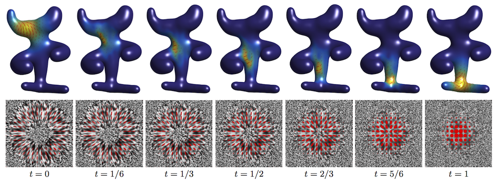

This toolbox reproduces the numerical illustrations of the paper:

G. Peyré, L. Chizat, F-X. Vialard, J. Solomon, Quantum Optimal Transport for Tensor Field Processing, Arxiv, 2016

Content
-------

The main functions are:
- quantum_sinkhorn: compute an optimal coupling between two tensor fields.
- quantum_interp: use such a coupling to compute an interpolation between the tensor fields.
- quantum_barycenter: compute a barycenter between several fields.

The main scripts to reproduce the figures of the article are:
- test_2x2_1d.m: 2x2 tensors in 1-D (along a line).
- test_3x3_1d.m: 3x3 tensors in 1-D (along a line).
- test_2x2_2d.m: 2x2 tensors in 2-D (image).
- test_2x2_meshes.m: 2x2 tensors on the tangent plane of a mesh.

Note that for these algorithms, tensor fields are stored in format (d,d,...) for tensors of size dxd so the first dimensions expose the tensors. This is opposed to the convention used for e.g. vizualization helpers tools.

Generic helper functions are in toolbox/.

Helper functions for the quantum-OT are implemented in toolbox_quantum/, in particular:
- load_helpers: load a structure filled with many simple functions.
- LSE: log-sum-exp operator, at the core of Sinkhorn iterations.
- expM / logM: fast matrix exp and log
- plot_tensors_1d/2d: vizualization
- load_tensors_pair: load synthetic 1D and 2D examples.

Helpers functions for mesh processing are in toolbox_geometry/.

For mesh computations, uses the Matlab toolbox toolbox_connections/ of [Keenan Crane](https://www.cs.cmu.edu/~kmcrane/Projects/TrivialConnections/).

Copyright
-------

Copyright (c) 2016 Gabriel Peyré
